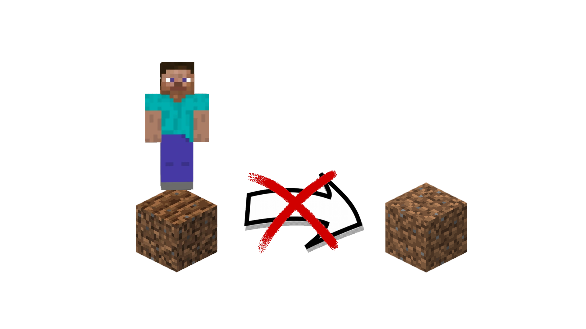

# JumpProofFarmland 

Tired to farm again the dirt after fall on it? You're in the right place at the right moment!

This mod prevents farmland to convert back to dirt when jumping on it

No needed of any <b>library</b>, this is a <b>stand-alone</b> mod

No addition of <b>blocks</b> or <b>items</b>

No needed to be added before world generation

